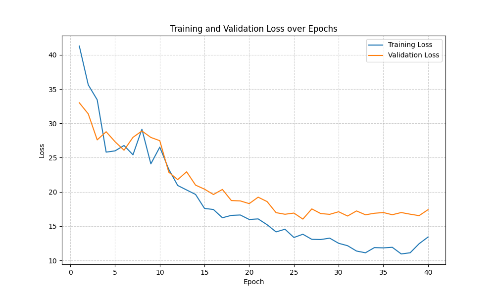
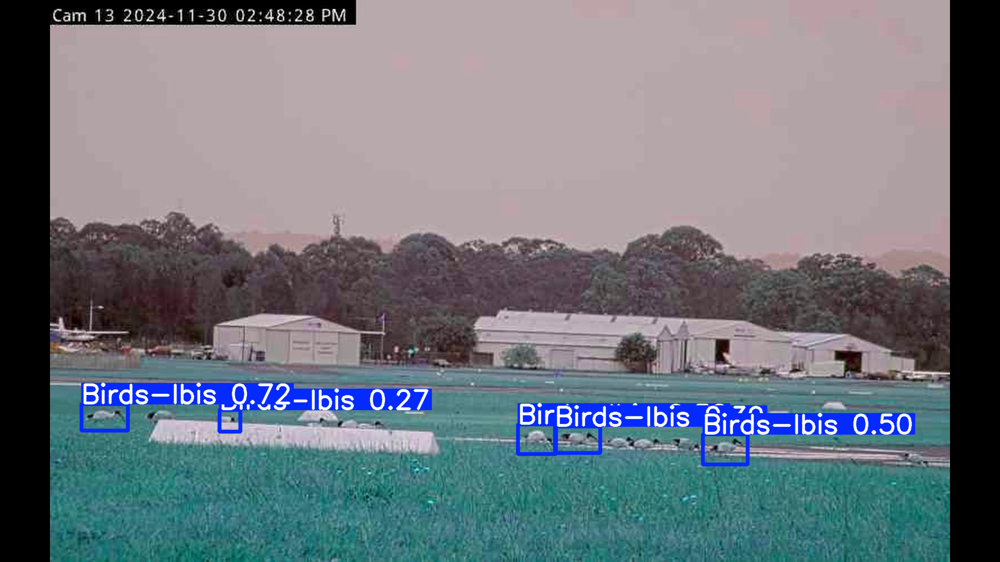

# YOLO-FGFA


## Environment Setup

Once you’ve cloned this repo, just:

1. **Create the environment**  
   ```bash
   conda env create -f assets/yolofgfa.yml
   
2. **Activate environment**
    ```bash
    conda activate yolofgfa

## Run Demo

python detect.py

|  |  |
|:-----------------------------:|:-----------------------------:|
